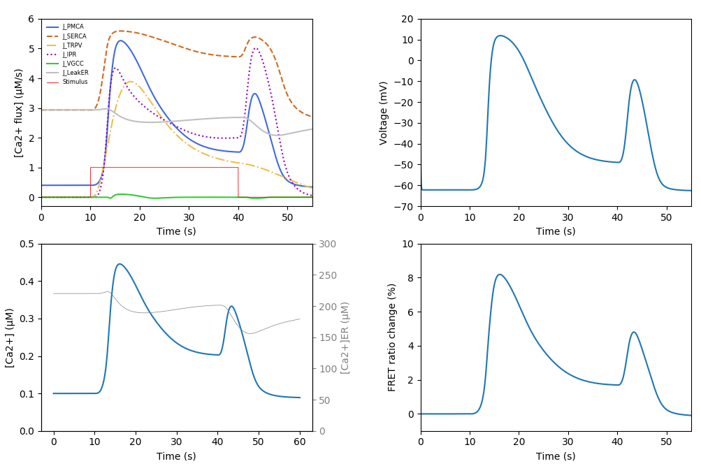

# ASH_neuroml2
Based on https://journals.plos.org/plosone/article?id=10.1371/journal.pone.0201302

Run `python createPlots.py` to create a figure of different Ca2+ fluxes/concentratios, membrane voltage, and % FRET ratio change.

